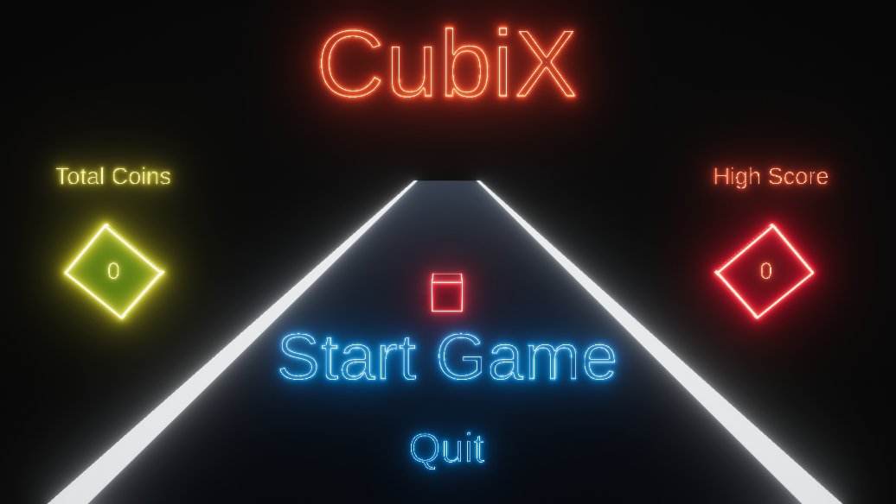
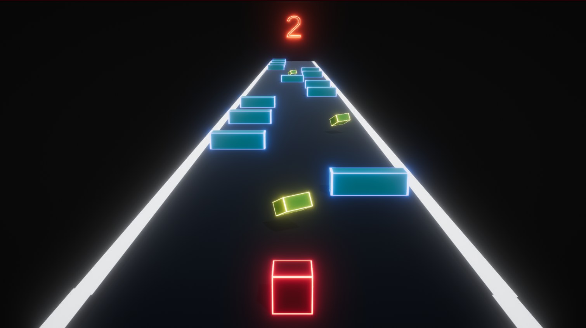
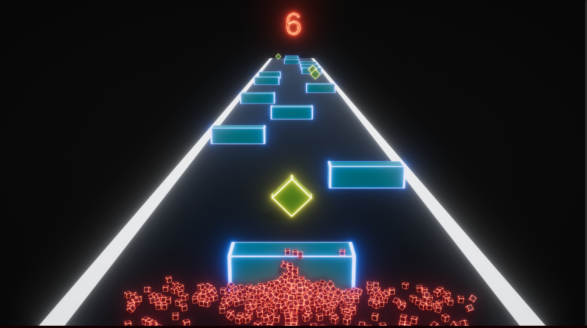
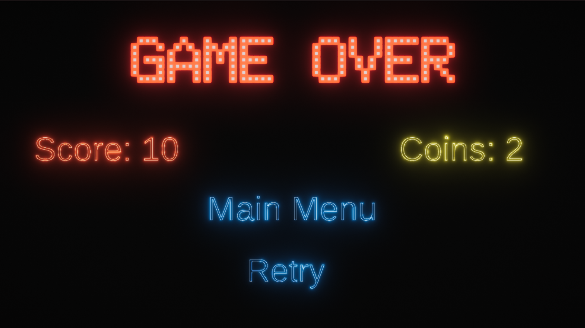
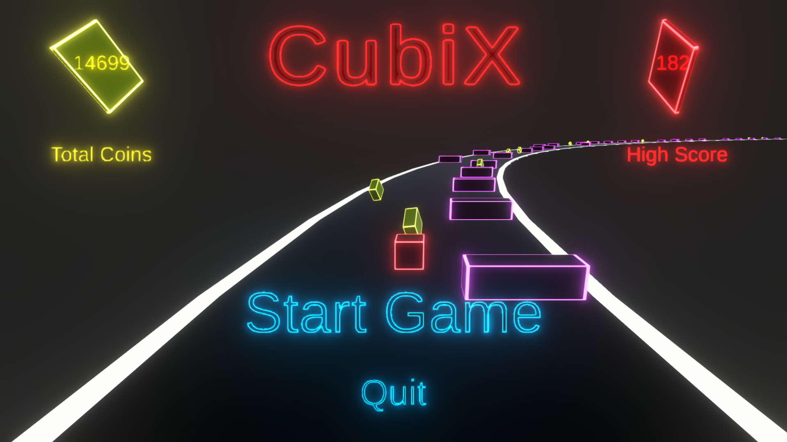
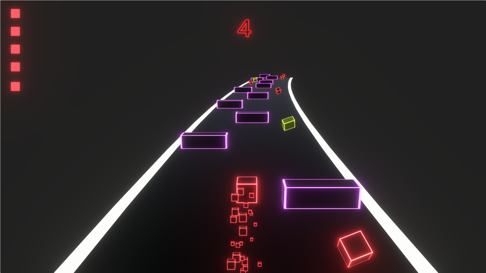
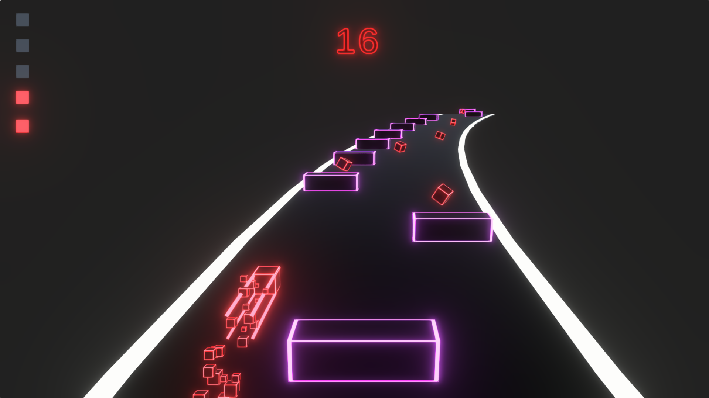
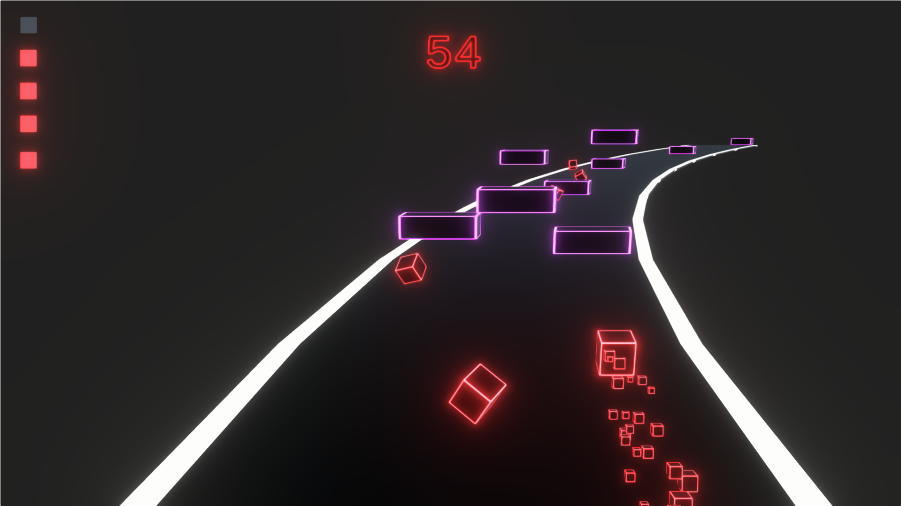

# Cubix-EndlessRunner

## Table of Contents
- [Overview](#overview)
- [How to Play](#how-to-play)
- [Features](#features)
  - [Version 1.0](#version-10)
  - [Version 1.2](#version-12)
- [Credits](#credits)

## Overview
Navigate a neon cube through a glowing endless map! Shrink as you go, grow by collecting cubes and dodge vibrant obstacles. Stay alive or explode into glowing pieces! ✨. 
This early release features fast-paced gameplay, a stylish design and challenges your reflexes.

## How to Play
[Play the game on Unity Play](https://play.unity.com/en/games/e59de455-5914-49e6-90d7-e9e5d8ceab5b/cubix)

- Movement: Use the arrow keys or WASD.
- Dodge the obstacles, collect the coins and collect the cubes to gain size.
- Try to get the highest score as the pace of the game gradually increases.

## Features

### Version 1.0

  
  

  
  

- **Player Mechanics**:
  - Horizontal line change movement with arrow keys. ( 3 line )
  - Acceleration over time.
 
- **Sounds**:
  - **Game Sounds**: Background music.

- **Game Systems**:
  - **Spawn Systems**: There are spawn systems for ground, obstacles and coins.
  - **High Score and Coin Systems**: There are level base and total count for score and coins. Used PlayerPrefs.
  - **Game Over System**: When colliding with an obstacle, the camera shakes and the player turns into small cubes. Level data is reset.

- **UI**:
  - **Main Menu**: The starting screen where players can begin the game or exit. 
  - **Game Over Panel**: Displayed when the player die. It contain main menu and retry buttons.
 
- **Visual Effects:**:
    - **Post-Processing**: Applied glow effects to the player, obstacles, coins, and ground to give a neon effect.
    - **TextMesh Pro(TMP)**: Texts are styled with glow effects for a polished UI experience.
 
### Version 1.2

  
  

  
  

- **Player Mechanics**:
  - Size increase and decrease.
  - Acceleration depends on level maximum speed.

- **Game Systems**:
  - **Game Over System**: The player dies when the cube's size shrinks until their health bar is depleted.
  - **Player Health System**: Player decreases in size over time and increases in size as player collect cubes. The health bar updates according to player size.
  - **Obstacle System**: There are different types of obstacles: motionless, horizontally moving and vertically moving. They appear by random chance.
  - **Curved World System**: The world is curved with a custom shader. The curve value is randomly generated on the X or Y axis.
 
- **Visual Effects:**:
    - **Custom Shaders**: There ara custom shaders for curve and glow effects.
    - **Player Particle**: Small neon cube particles are present for size loss effect.
    - **Player Trail**: As the player speed increases, neon trails appear.

## Credits

This project uses various assets from the Unity Asset Store. Below are the credits and links to the assets used:
  
Sound Effects:
- [Sound Effects Pack for background music](https://assetstore.unity.com/packages/audio/music/electronic/breathtaking-vol-1-cyberpunk-electro-dark-synthwave-game-music-p-202947)

